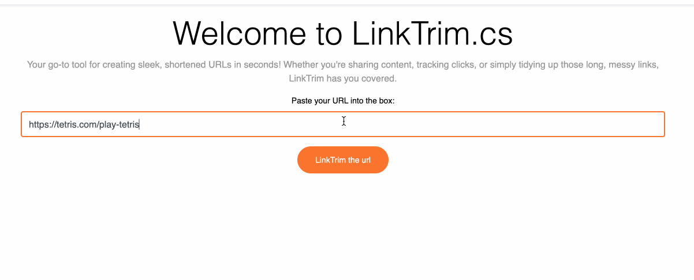

# LinkTrim

LinkTrim is a simple URL shortening tool implemented in C#. It provides a way to shorten long URLs into shorter, more manageable links.



## Features

- Shorten long URLs to compact, easy-to-use links
- Customizable URL shortening strategies
- Provides an interface for creating and managing shortened URLs
- Ability to generate and store compact links in a data store (e.g., Redis, database)

## Getting Started

These instructions will help you get a copy of the project up and running on your local machine for development and testing purposes.

### Prerequisites

To run this project, you will need:
- [.NET Core SDK](https://dotnet.microsoft.com/download) installed on your machine
- [Redis Server](https://redis.io/download) running locally or accessible from your environment (if using Redis for storage)

### Running with Docker Compose

You can easily start the entire LinkTrim project using Docker Compose, which will manage both the application and Redis containers.

```docker compose up```
